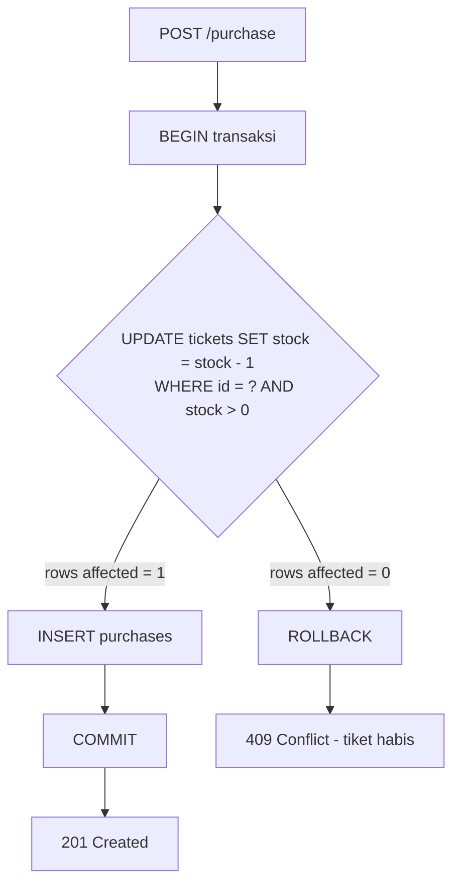
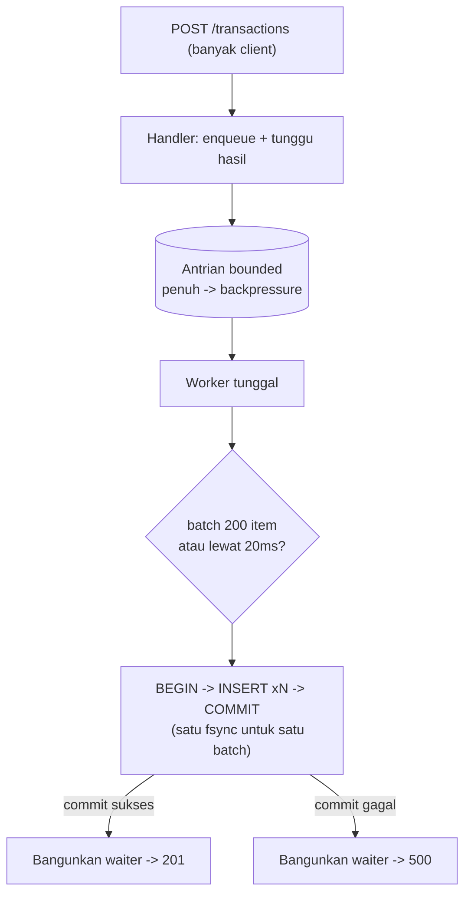

# Ticket Booking - Backend Assessment

Service pemesanan tiket konser untuk technical assessment. Dibangun dengan Go + SQLite (embedded, tanpa perlu database server terpisah).

## Menjalankan

```
go run ./cmd/server
```

Server jalan di `:8080` (override dengan env `PORT`, lokasi database dengan `DB_PATH`, default `data.db`). Saat start, tiket `vip-1` di-seed dengan stok 1 sesuai skenario assessment.

## Scenario 1 - Race Condition

**Masalah.** Alur lama: baca stok -> cek di aplikasi -> kurangi stok -> simpan transaksi. Antara "baca" dan "kurangi" ada jeda waktu. Dua request yang datang hampir bersamaan sama-sama membaca stok `1`, sama-sama lolos pengecekan, dan sama-sama jadi membeli - 1 tiket terjual 2 kali.

**Solusi.** Pengecekan dan pengurangan stok dipindah ke database sebagai satu statement atomik, dibungkus satu transaksi bersama insert pembelian:

```sql
UPDATE tickets SET stock = stock - 1 WHERE id = ? AND stock > 0
-- rows affected = 1 -> INSERT purchases, COMMIT -> 201
-- rows affected = 0 -> tiket habis, ROLLBACK -> 409
```

Database mengeksekusi UPDATE pada baris yang sama secara serial, jadi hanya satu request yang menemukan `stock > 0` bernilai benar. Request yang kalah tidak "lolos cek lalu gagal tulis" - cek dan tulisnya memang satu operasi.

**Asumsi.** Satu instance aplikasi dan SQLite cukup untuk skala assessment. Pola conditional update ini identik perilakunya di PostgreSQL/MySQL, jadi solusinya tidak terikat SQLite.

**Trade-off.** Penulisan ke baris tiket yang sama otomatis terserialisasi - aman, tapi jadi titik antrian kalau satu tiket diserbu ekstrem (puluhan ribu req/detik ke baris yang sama). Di skala itu alternatifnya reservation queue atau stok terpartisi, dengan kompleksitas jauh lebih tinggi.



**Demo.** Dua pembeli berebut 1 tiket VIP terakhir - satu dapat `201`, satunya `409`:

```
curl -s -X POST localhost:8080/purchase -d '{"ticket_id":"vip-1","user_id":"andi","amount":500}' &
curl -s -X POST localhost:8080/purchase -d '{"ticket_id":"vip-1","user_id":"budi","amount":500}' &
wait
curl -s localhost:8080/tickets/vip-1   # stok akhir: 0
```

## Scenario 2 - High Traffic Processing

**Masalah.** Lebih dari 10.000 transaksi masuk dalam waktu kurang dari 1 menit, dan setiap transaksi yang dijawab sukses harus benar-benar tersimpan - tidak boleh ada yang hilang diam-diam.

**Analisis.** Dua jebakan umum di sini: (1) commit database per request - tiap commit memaksa fsync, jadi throughput mentok jauh di bawah kebutuhan; (2) solusi naifnya, "lempar ke antrian lalu langsung balas sukses" - throughput naik tapi janji sukses diberikan *sebelum* data aman, persis sumber transaksi hilang saat proses mati.

**Solusi.** Antrian bounded + satu worker yang menulis secara batch, dengan aturan ketat: **response sukses baru dikirim setelah batch berisi transaksi itu ter-commit**.

- Handler memasukkan transaksi ke antrian lalu *menunggu* hasil commit-nya.
- Worker mengumpulkan sampai 200 transaksi atau 20ms (mana yang lebih dulu), menulis semuanya dalam satu transaksi DB, lalu membangunkan semua yang menunggu. Ratusan insert menumpang satu fsync.
- Antrian penuh -> `Submit` menunggu (backpressure), bukan menerima-lalu-hilang.
- Saat shutdown (SIGTERM), server berhenti menerima request baru lalu menguras sisa antrian sampai habis sebelum keluar.

Hasil di mesin uji: 10.000 transaksi persisten dalam ~0,5 detik (~18.000 tx/detik) - kebutuhan soal hanya ~167 tx/detik.

**Asumsi.** "Sukses" didefinisikan dari sudut pandang client: transaksi disebut sukses hanya kalau sudah menerima `201`, dan `201` hanya keluar setelah data persisten. Client yang tidak menerima jawaban (timeout/putus) wajib menganggap statusnya tidak pasti dan boleh mengirim ulang.

**Trade-off.** Latency per request naik sebesar jendela flush (<=20ms) - harga yang wajar untuk jaminan durability. Satu baris rusak menggagalkan seluruh batch-nya (semua waiter diberi error, tidak ada yang dibohongi "sukses"). Antrian in-memory hilang kalau proses crash, tapi karena ack-setelah-persist, yang hilang hanyalah request yang memang belum dijawab sukses - client tahu dan bisa retry. Di skala multi-node, antrian ini digantikan message broker durable (Kafka/RabbitMQ) dengan prinsip yang sama: ack setelah persisten.



**Demo.**

```
curl -s -X POST localhost:8080/transactions -d '{"ticket_id":"vip-1","user_id":"cici","amount":100}'
# -> {"id":"tx-...","status":"stored"}   <- dikirim SETELAH data ter-commit
```

## Testing

```
go test -race ./...
```

Test kunci per skenario:

- `TestBuy_SatuTiketBanyakPembeli` (S1) - 100 pembeli serentak ke 1 tiket tersisa: tepat satu berhasil, sisanya `409`, stok akhir 0, hanya 1 baris purchase.
- `TestSubmit_10RibuSemuaTersimpan` (S2) - 10.000 submit serentak: semua dijawab sukses dan semuanya terhitung di database.
- `TestSubmit_BatchGagalSemuaDapatError` (S2) - kalau satu batch gagal commit, semua request di batch itu dapat error, tidak ada yang dijawab sukses palsu.
