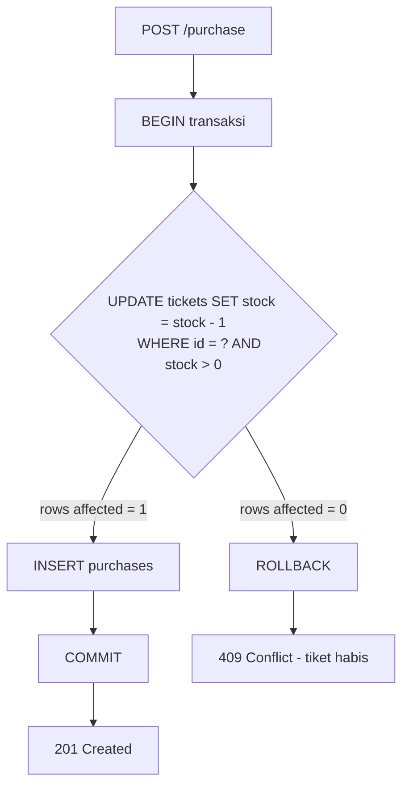
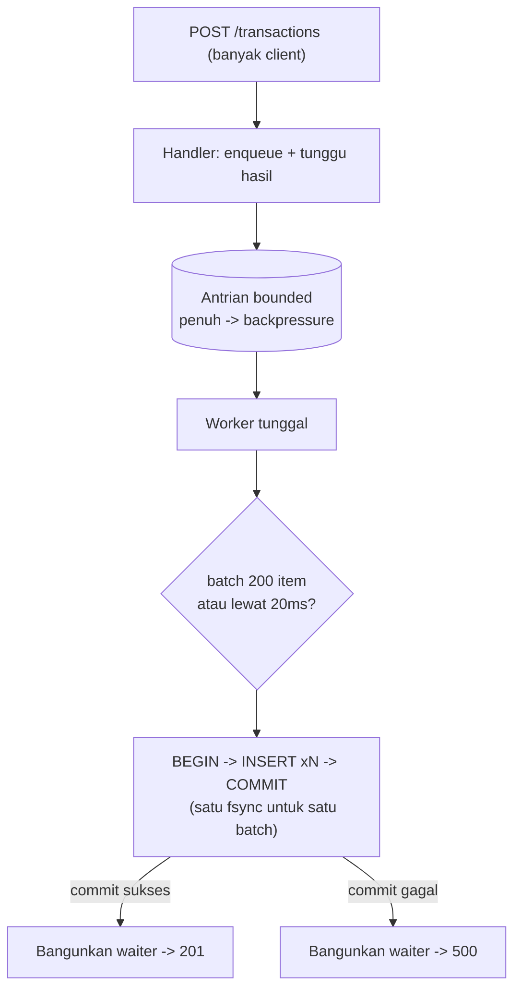
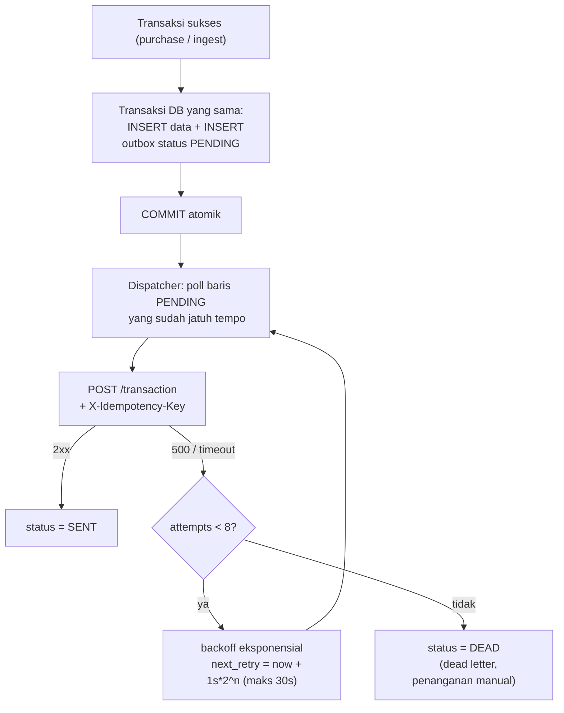
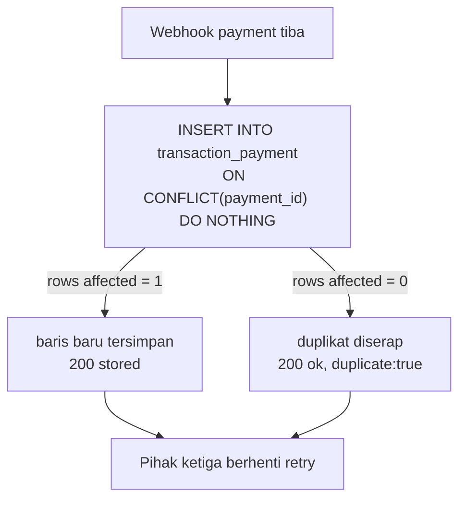
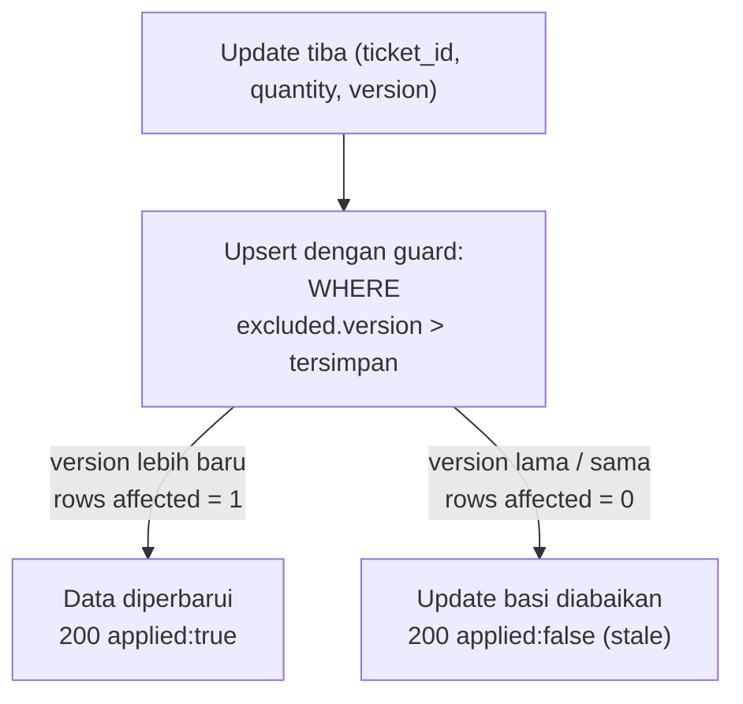
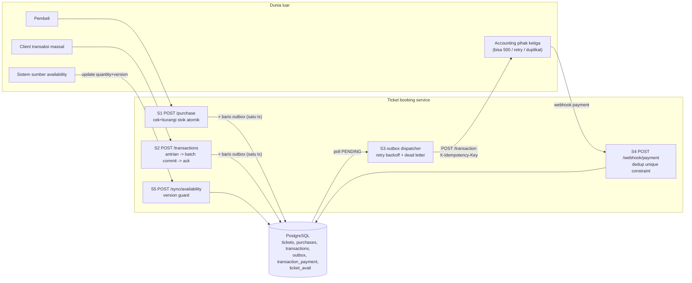

# Ticket Booking - Backend Assessment

## Tech stack

- Go 1.26 (net/http + database/sql, tanpa framework)
- PostgreSQL 16 (driver pgx)
- Docker + Docker Compose
- Mermaid untuk diagram flow (agar dapat dirender otomatis oleh GitHub)
- go test -race untuk automated test

## Cara menjalankan

```
docker compose up -d --build
```

- `:8080` - API utama
- `:9090` - mock accounting(pihak ketiga)

Jika port default bentrok, override lewat env: `PORT=8096 MOCK_PORT=9096 DB_PORT=5434 docker compose up`. Daftar lengkap variabel ada di `.env.example` (salin jadi `.env`, docker compose membacanya otomatis).

Bisa juga jalan tanpa container untuk development: `docker compose up -d db` lalu `go run ./cmd/server` (koneksi diatur env `DATABASE_URL`, defaultnya:`localhost:5432`). Env lain: `ACCOUNTING_URL` (default menunjuk ke mock). Saat start, tiket `vip-1` di-seed dengan stok 1 sesuai skenario.

## Scenario 1 - Race Condition

**Masalah:** 
Alur lama: baca stok -> cek di aplikasi -> kurangi stok -> simpan transaksi. Antara "baca" dan "kurangi" ada jeda waktu. Dua request yang datang hampir bersamaan sama-sama membaca stok `1`, sama-sama lolos pengecekan, dan sama-sama jadi membeli. Ujungnya 1 tiket terjual 2 kali.

**Solusi.** Pengecekan dan pengurangan stok dipindah ke database sebagai satu statement atomik, dibungkus satu transaksi bersama insert pembelian:

```sql
UPDATE tickets SET stock = stock - 1 WHERE id = ? AND stock > 0
-- rows affected = 1 -> INSERT purchases, COMMIT -> 201
-- rows affected = 0 -> tiket habis, ROLLBACK -> 409
```

Database mengeksekusi UPDATE pada baris yang sama secara serial, jadi hanya satu request yang menemukan `stock > 0` bernilai benar. Request yang kalah tidak "lolos cek lalu gagal tulis", karena cek dan tulisnya memang satu operasi.

**Asumsi.** Satu instance aplikasi cukup untuk skala assessment. Pola conditional update ini SQL standar; perilakunya sama di PostgreSQL atau database relasional lain.

**Trade-off.** Penulisan ke baris tiket yang sama otomatis terserialisasi. Aman, tapi jadi titik antrian kalau satu tiket diserbu ekstrem (puluhan ribu req/detik ke baris yang sama). Di skala itu alternatifnya reservation queue atau stok terpartisi.



**Example:** Dua pembeli berebut 1 tiket VIP terakhir, satu dapat `201`, satunya `409`:

```
curl -s -X POST localhost:8080/purchase -d '{"ticket_id":"vip-1","user_id":"andi","amount":500}' &
curl -s -X POST localhost:8080/purchase -d '{"ticket_id":"vip-1","user_id":"budi","amount":500}' &
wait
curl -s localhost:8080/tickets/vip-1   # stok akhir: 0
```

## Scenario 2 - High Traffic Processing

**Masalah.** Lebih dari 10.000 transaksi masuk dalam waktu kurang dari 1 menit, dan setiap transaksi yang dijawab sukses harus benar-benar tersimpan, tidak boleh ada yang hilang.

**Analisis:**
Ada 2 masalah umum:
1. Commit database setiap request -> terlalu banyak proses commit/fsync, sehingga database cepat menjadi bottleneck dan throughput rendah.
2. Langsung masukkan ke queue lalu balas sukses -> memang lebih cepat, tapi berisiko kehilangan data jika server mati sebelum data benar-benar tersimpan.

**Solusi.** Antrian bounded + satu worker yang menulis secara batch, dengan aturan ketat: **response sukses baru dikirim setelah batch berisi transaksi itu ter-commit**.

- Request masuk -> masuk ke antrian, lalu request menunggu sampai datanya benar-benar tersimpan di database.
- Worker mengumpulkan transaksi hingga 200 transaksi atau 20ms, lalu menyimpannya sekaligus dalam 1 transaksi database. Jadi banyak insert hanya membutuhkan 1 kali fsync/commit.
- Jika antrian penuh, request akan menunggu sampai ada kapasitas. Data tidak langsung ditolak atau hilang.
- Saat server dimatikan, server berhenti menerima request baru, lalu menyelesaikan semua transaksi yang masih ada di antrian sebelum benar-benar shutdown.

**Asumsi.**
- Transaksi dianggap sukses hanya jika client menerima 201.
- 201 hanya dikirim setelah data benar-benar tersimpan.
- Jika client timeout atau koneksi terputus, status transaksi dianggap tidak pasti, sehingga client boleh retry.

**Trade-off.** 
- Response bisa sedikit lebih lambat, maksimal sekitar 20ms, karena menunggu batch.
- Jika 1 transaksi dalam batch gagal, seluruh batch dianggap gagal. Tidak ada transaksi yang pura-pura dianggap sukses.
- Jika server crash, transaksi yang masih ada di in-memory queue bisa hilang. Namun transaksi tersebut belum pernah mendapat 201, sehingga client tahu bahwa transaksi belum pasti berhasil dan bisa melakukan retry.
- Untuk sistem multi-server, in-memory queue dapat diganti dengan Kafka/RabbitMQ agar queue tetap aman meskipun server mati.



**Example:**

```
curl -s -X POST localhost:8080/transactions -d '{"ticket_id":"vip-1","user_id":"cici","amount":100}'
# {"id":"tx-...","status":"stored"}  (respon dikirim SETELAH data ter-commit)
```

## Scenario 3 - External API Integration

**Masalah:** 
Setiap transaksi yang berhasil harus dikirim ke accounting software pihak ketiga. Namun, pihak ketiga bisa error (500), timeout, atau tidak bisa diakses.

**Solusi: transactional outbox.** Saat transaksi disimpan ke database, sistem juga menyimpan tugas pengiriman ke accounting di tabel outbox dalam transaksi yang sama.
```
Transaksi berhasil
      |
      v
Database
 |-- Data transaksi
 `-- Outbox: PENDING
```

Keduanya sama-sama tersimpan atau sama-sama gagal, sehingga tidak ada transaksi yang tersimpan tanpa tugas pengiriman.
Kemudian dispatcher mengambil data PENDING dan mengirimkannya ke accounting:
1. Gagal / timeout -> retry otomatis dengan jeda bertahap: 1s -> 2s -> 4s -> ... -> 30s.
2. Gagal 8 kali -> status menjadi DEAD dan berhenti retry otomatis untuk ditangani manual.
3. Setiap retry menggunakan X-Idempotency-Key yang sama, sehingga jika request sebenarnya sudah diterima accounting tetapi responsnya hilang, retry tidak membuat transaksi tercatat dua kali.

**Asumsi:** 
- Accounting pihak ketiga pada akhirnya akan kembali normal.
- Sistem menggunakan at-least-once delivery, artinya transaksi bisa dikirim lebih dari sekali.
- Idempotency key digunakan untuk mencegah transaksi tercatat dua kali.
- Exactly-once antar sistem tidak bisa dijamin hanya oleh sistem kita karena ada kemungkinan masalah jaringan. Harus ada dukungan dari pihak ketiga juga.

**Trade-off.** 
- (Jeda ketika transaksi) Transaksi bisa tersimpan dulu di sistem kita, baru beberapa saat kemudian masuk ke accounting. Ini disebut eventual consistency. Ini memang disengaja: pembelian user tetap berhasil meskipun accounting sedang down.
- Dispatcher melakukan polling untuk mencari transaksi yang belum terkirim. Pada skala besar, polling bisa diganti dengan CDC atau notification, tetapi konsepnya tetap sama.



**Example:** Mock accounting di `:9090` sengaja membalas `500` dua kali pertama per kiriman:

```
curl -s -X POST localhost:8080/purchase -d '{"ticket_id":"vip-1","user_id":"andi","amount":500}'
curl -s localhost:8080/outbox/stats     # {"PENDING":1}
# log server: percobaan 1 gagal (http 500), retry dalam 1s ... percobaan 2 ... terkirim
sleep 4 && curl -s localhost:8080/outbox/stats   # {"SENT":1}
curl -s localhost:9090/stats            # {"received":1} - diterima tepat sekali
```

## Scenario 4 - Duplicate Request

**Masalah.** Pihak ketiga mengirim webhook payment ke sistem kita untuk menyimpan data pembayaran. Jika response kita tidak sampai ke mereka karena masalah jaringan, mereka akan mengirim ulang webhook. Bahkan, dua webhook yang sama bisa datang bersamaan.

**Analisis.** Ini sebenarnya adalah race condition. Karena kedua request berjalan bersamaan, keduanya bisa sama-sama melihat bahwa data belum ada, lalu keduanya melakukan INSERT.

**Solusi.** Database memastikan payment_id hanya bisa tersimpan satu kali dengan UNIQUE(payment_id) + ON CONFLICT DO NOTHING.
Alurnya:
1. Request pertama -> payment berhasil disimpan -> balas 200 {"status":"stored"}.
2. Request duplikat, termasuk yang datang bersamaan -> tidak disimpan lagi -> tetap balas 200 {"duplicate":true}.
3. Duplikat tetap dibalas 200, bukan error. Karena bagi pihak ketiga, data tersebut sebenarnya sudah berhasil tersimpan. Kalau dibalas error, mereka akan menganggap gagal dan terus melakukan retry.

**Asumsi.** 
- payment_id dari pihak ketiga harus tetap sama setiap kali mereka melakukan retry. Ini menjadi ID unik untuk mengenali payment yang sama.
- Jika pihak ketiga tidak memberikan ID yang stabil, kita bisa membuat hash dari isi payload sebagai ID unik.
- Payload asli disimpan agar bisa digunakan untuk audit atau pengecekan jika terjadi masalah.

**Trade-off.** 
- Hanya membutuhkan satu UNIQUE INDEX pada payment_id, jadi overhead-nya relatif kecil.
- Perlu ditentukan berapa lama payment_id disimpan untuk mencegah duplikasi.
- Untuk assessment ini, data disimpan permanen.
- Di production, biasanya cukup disimpan selama periode maksimal retry dari pihak ketiga.



**Example:x** Kirim webhook identik dua kali (boleh paralel):

```
BODY='{"payment_id":"pay_9","transaction_id":"tx-1","amount":500}'
curl -s -X POST localhost:8080/webhook/payment -d "$BODY"   # {"status":"stored"}
curl -s -X POST localhost:8080/webhook/payment -d "$BODY"   # {"duplicate":true,"status":"ok"}
```

## Scenario 5 - Data Synchronization

**Masalah.**
Sistem mengirim 2 update:
```
Update 1 -> quantity = 5
Update 2 -> quantity = 2
```
Seharusnya kondisi akhirnya 2. Tetapi karena masalah jaringan, update 2 tiba lebih dulu:
```
Update 2 -> tiba dulu -> quantity = 2
Update 1 -> tiba belakangan -> quantity = 5
```
Akibatnya sistem tujuan menampilkan 5, padahal data terbaru sebenarnya 2.

**Solusi.** Setiap update harus membawa version dari sistem sumber untuk menunjukkan urutannya, contohnya script di bawah:

**Contoh flow Alurnya**
```
Update 1 -> quantity=5, version=1
Update 2 -> quantity=2, version=2
```
Jika version=2 datang lebih dulu:
```
Simpan version=2 -> quantity=2
```
Kemudian version=1 datang terlambat:
```
version=1 < version=2
-> diskip
```

contohnya script di bawah:
```sql
INSERT INTO ticket_avail (ticket_id, quantity, version) VALUES (?, ?, ?)
ON CONFLICT(ticket_id) DO UPDATE SET quantity = excluded.quantity, version = excluded.version
WHERE excluded.version > ticket_avail.version
```

Guard-nya berada **di dalam** statement upsert, bukan "SELECT version dulu, bandingkan di aplikasi, baru tulis" yang punya celah waktu yang sama dengan Scenario 1. Update data lampau dijawab `200 {"applied":false,"reason":"stale version"}`: tetap di-ack supaya pengirim tidak retry, tapi datanya diabaikan.

**Asumsi.** SSistem sumber bisa membuat version yang selalu naik secara berurutan untuk setiap tiket. Alternatif version: timestamp sumber (tapi ada rentan clock skew antar server) atau sequence dari message broker.

**Trade-off.** Semua pengirim wajib mengikuti aturan version. Kalau ada satu pengirim yang menulis data tanpa version, mekanisme pencegahan update data lampau bisa rusak.



**Example:** Update v2 tiba duluan, v1 telat:

```
curl -s -X POST localhost:8080/sync/availability -d '{"ticket_id":"vip-1","quantity":2,"version":2}'   # applied:true
curl -s -X POST localhost:8080/sync/availability -d '{"ticket_id":"vip-1","quantity":5,"version":1}'   # applied:false, stale
curl -s localhost:8080/sync/availability/vip-1    # quantity=2, version=2
```

## Diagram flow gabungan

Kelima skenario dalam satu kesatuan: satu aplikasi, satu database, dengan integrasi ke sistem lain dalam dua arah.



Kesimpulan yg bisa saya ambil dari assesment yg diberikan:
1. Operasi penting harus dijamin oleh database secara atomik.
Contohnya:
S1: cek stok dan kurangi stok sekaligus.
S3: simpan transaksi dan catat tugas pengiriman sekaligus.
S4: cegah payment yang sama tersimpan dua kali.
S5: hanya terima update dengan version yang lebih baru.
Kenapa? Karena kalau cek dilakukan di aplikasi lalu baru menulis ke database, request lain bisa masuk di antara kedua proses tersebut dan menyebabkan race condition.

2. Anggap jaringan selalu bisa bermasalah.
Karena request bisa timeout, gagal, terlambat, atau terkirim ulang, maka sistem harus siap menghadapinya:
S2: baru mengatakan sukses setelah data benar-benar tersimpan.
S3: simpan dulu tugas pengiriman, lalu retry jika gagal.
S4: request yang sama bisa datang berkali-kali, tetapi hanya disimpan sekali.
S5: update yang lebih lama bisa datang belakangan, tetapi tidak boleh menimpa data terbaru.

## Menjalankan demo semua skenario

Dengan server berjalan, di terminal lain:

```
./scripts/demo.sh
```

Script menembakkan kelima skenario berurutan via curl (port custom: `BASE=localhost:8095 MOCK=localhost:9095 ./scripts/demo.sh`).

## Testing

Test jalan melawan postgres sungguhan (bukan mock), jadi nyalakan database-nya dulu:

```
docker compose up -d db
set -a; source .env; set +a #read env var
go test -race ./...
```

Tiap test membuat schema sekali pakai dan membuangnya saat selesai, jadi test antar package aman jalan paralel. Postgres di lokasi lain bisa dioverride lewat `TEST_DATABASE_URL`.

Test kunci per skenario:

- `TestBuy_SatuTiketBanyakPembeli` (S1) - 100 pembeli serentak ke 1 tiket tersisa: tepat satu berhasil, sisanya `409`, stok akhir 0, hanya 1 baris purchase.
- `TestSubmit_10RibuSemuaTersimpan` (S2) - 10.000 submit serentak: semua dijawab sukses dan semuanya terhitung di database.
- `TestSubmit_BatchGagalSemuaDapatError` (S2) - kalau satu batch gagal commit, semua request di batch itu dapat error, tidak ada yang dijawab sukses palsu.
- `TestDispatcher_Retry500SampaiTerkirim` (S3) - pihak ketiga membalas 500 dua kali lalu pulih: retry jalan, berakhir `SENT`, diterima tepat sekali.
- `TestDispatcher_DeadLetterSetelahMaxAttempts` (S3) - pihak ketiga mati total: berhenti di `DEAD` setelah batas percobaan, tidak retry selamanya.
- `TestBuy_MencatatOutbox` / `TestSubmit_MencatatOutbox` (S3) - baris outbox lahir di transaksi DB yang sama; pembelian gagal tidak meninggalkan outbox.
- `TestStore_DuplikatSerentakSatuBaris` (S4) - 50 webhook identik serentak: semua dijawab sukses, tepat 1 baris tersimpan.
- `TestApply_UpdateTerbalik` (S5) - v2 tiba duluan, v1 telat: yang basi ditolak, hasil akhir qty=2.
- `TestApply_KonkurenVersiTertinggiMenang` (S5) - 30 versi datang serentak dalam urutan acak: version tertinggi selalu menang.
