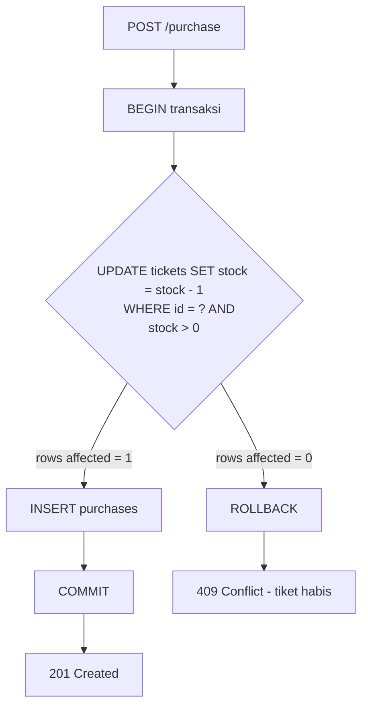
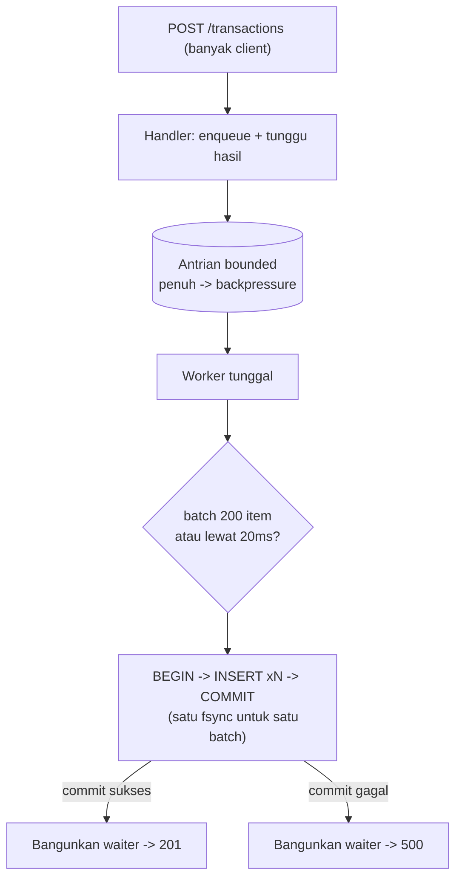
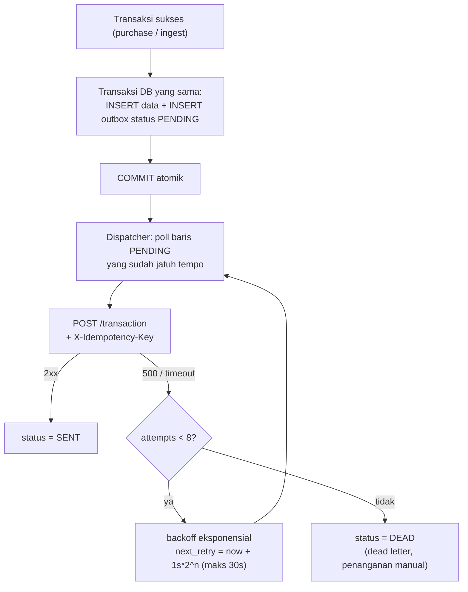
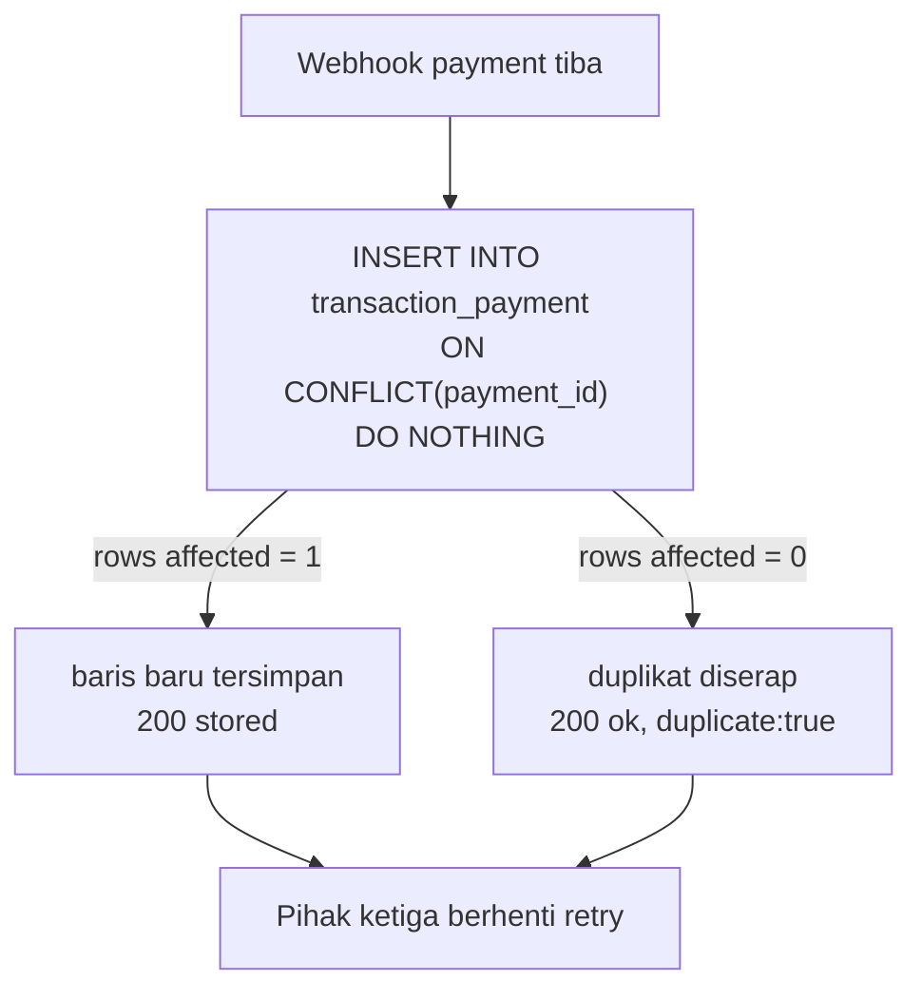

# Ticket Booking - Backend Assessment

Service pemesanan tiket konser untuk technical assessment. Dibangun dengan Go + SQLite (embedded, tanpa perlu database server terpisah).

## Menjalankan

```
go run ./cmd/server
```

Aplikasi menjalankan dua listener:

- `:8080` - API utama (env `PORT`)
- `:9090` - mock accounting pihak ketiga (env `MOCK_PORT`), sengaja membalas `500` dua kali pertama per kiriman untuk mendemonstrasikan retry Scenario 3 (atur lewat `MOCK_FAIL_FIRST`)

Env lain: `DB_PATH` (default `data.db`), `ACCOUNTING_URL` (default menunjuk ke mock). Saat start, tiket `vip-1` di-seed dengan stok 1 sesuai skenario assessment.

## Scenario 1 - Race Condition

**Masalah.** Alur lama: baca stok -> cek di aplikasi -> kurangi stok -> simpan transaksi. Antara "baca" dan "kurangi" ada jeda waktu. Dua request yang datang hampir bersamaan sama-sama membaca stok `1`, sama-sama lolos pengecekan, dan sama-sama jadi membeli - 1 tiket terjual 2 kali.

**Solusi.** Pengecekan dan pengurangan stok dipindah ke database sebagai satu statement atomik, dibungkus satu transaksi bersama insert pembelian:

```sql
UPDATE tickets SET stock = stock - 1 WHERE id = ? AND stock > 0
-- rows affected = 1 -> INSERT purchases, COMMIT -> 201
-- rows affected = 0 -> tiket habis, ROLLBACK -> 409
```

Database mengeksekusi UPDATE pada baris yang sama secara serial, jadi hanya satu request yang menemukan `stock > 0` bernilai benar. Request yang kalah tidak "lolos cek lalu gagal tulis" - cek dan tulisnya memang satu operasi.

**Asumsi.** Satu instance aplikasi dan SQLite cukup untuk skala assessment. Pola conditional update ini identik perilakunya di PostgreSQL/MySQL, jadi solusinya tidak terikat SQLite.

**Trade-off.** Penulisan ke baris tiket yang sama otomatis terserialisasi - aman, tapi jadi titik antrian kalau satu tiket diserbu ekstrem (puluhan ribu req/detik ke baris yang sama). Di skala itu alternatifnya reservation queue atau stok terpartisi, dengan kompleksitas jauh lebih tinggi.



**Demo.** Dua pembeli berebut 1 tiket VIP terakhir - satu dapat `201`, satunya `409`:

```
curl -s -X POST localhost:8080/purchase -d '{"ticket_id":"vip-1","user_id":"andi","amount":500}' &
curl -s -X POST localhost:8080/purchase -d '{"ticket_id":"vip-1","user_id":"budi","amount":500}' &
wait
curl -s localhost:8080/tickets/vip-1   # stok akhir: 0
```

## Scenario 2 - High Traffic Processing

**Masalah.** Lebih dari 10.000 transaksi masuk dalam waktu kurang dari 1 menit, dan setiap transaksi yang dijawab sukses harus benar-benar tersimpan - tidak boleh ada yang hilang diam-diam.

**Analisis.** Dua jebakan umum di sini: (1) commit database per request - tiap commit memaksa fsync, jadi throughput mentok jauh di bawah kebutuhan; (2) solusi naifnya, "lempar ke antrian lalu langsung balas sukses" - throughput naik tapi janji sukses diberikan *sebelum* data aman, persis sumber transaksi hilang saat proses mati.

**Solusi.** Antrian bounded + satu worker yang menulis secara batch, dengan aturan ketat: **response sukses baru dikirim setelah batch berisi transaksi itu ter-commit**.

- Handler memasukkan transaksi ke antrian lalu *menunggu* hasil commit-nya.
- Worker mengumpulkan sampai 200 transaksi atau 20ms (mana yang lebih dulu), menulis semuanya dalam satu transaksi DB, lalu membangunkan semua yang menunggu. Ratusan insert menumpang satu fsync.
- Antrian penuh -> `Submit` menunggu (backpressure), bukan menerima-lalu-hilang.
- Saat shutdown (SIGTERM), server berhenti menerima request baru lalu menguras sisa antrian sampai habis sebelum keluar.

Hasil di mesin uji: 10.000 transaksi persisten dalam ~1,4 detik (~7.000 tx/detik; sebelum tiap transaksi ikut menulis baris outbox Scenario 3, ~18.000 tx/detik) - kebutuhan soal hanya ~167 tx/detik.

**Asumsi.** "Sukses" didefinisikan dari sudut pandang client: transaksi disebut sukses hanya kalau sudah menerima `201`, dan `201` hanya keluar setelah data persisten. Client yang tidak menerima jawaban (timeout/putus) wajib menganggap statusnya tidak pasti dan boleh mengirim ulang.

**Trade-off.** Latency per request naik sebesar jendela flush (<=20ms) - harga yang wajar untuk jaminan durability. Satu baris rusak menggagalkan seluruh batch-nya (semua waiter diberi error, tidak ada yang dibohongi "sukses"). Antrian in-memory hilang kalau proses crash, tapi karena ack-setelah-persist, yang hilang hanyalah request yang memang belum dijawab sukses - client tahu dan bisa retry. Di skala multi-node, antrian ini digantikan message broker durable (Kafka/RabbitMQ) dengan prinsip yang sama: ack setelah persisten.



**Demo.**

```
curl -s -X POST localhost:8080/transactions -d '{"ticket_id":"vip-1","user_id":"cici","amount":100}'
# -> {"id":"tx-...","status":"stored"}   <- dikirim SETELAH data ter-commit
```

## Scenario 3 - External API Integration

**Masalah.** Setiap transaksi sukses harus sampai ke accounting software pihak ketiga (`POST /transaction`), tapi pihak ketiga bisa membalas `HTTP 500`, timeout, atau tidak terjangkau. Dua cara yang salah: mengirim *sebelum* commit (kalau commit batal, accounting mencatat transaksi yang tidak pernah ada) dan mengirim *setelah* commit tanpa pencatatan (kalau proses mati di antara keduanya, transaksi tersimpan tapi tidak pernah terkirim - hilang diam-diam).

**Solusi: transactional outbox.** Niat mengirim dicatat sebagai baris di tabel `outbox` **dalam transaksi database yang sama** dengan penulisan transaksinya - dua-duanya jadi atomik: sama-sama tersimpan, atau sama-sama batal. Dispatcher terpisah lalu membaca baris `PENDING` dan mengirimkannya:

- Gagal (`500`/timeout/putus) -> dijadwalkan ulang dengan **exponential backoff** (1s, 2s, 4s, ... maks 30s) supaya pihak ketiga yang sedang sakit tidak dihujani request.
- Setelah 8 kali gagal -> status `DEAD` (dead letter): berhenti retry otomatis, menunggu penanganan manual - baris rusak tidak boleh menyandera antrian selamanya.
- Setiap kiriman membawa header `X-Idempotency-Key` yang stabil di semua retry, supaya pihak ketiga bisa mendeteksi kiriman ulang (retry sukses yang balasannya hilang di jalan tidak jadi dobel di sisi mereka).

Kedua jalur transaksi memakai pola ini: pembelian tiket (S1) dan ingest volume tinggi (S2, baris outbox ikut di transaksi batch).

**Asumsi.** Pihak ketiga pada akhirnya pulih (transient failure); jaminan yang diberikan *at-least-once delivery* + idempotency key, karena *exactly-once* lintas jaringan tidak mungkin tanpa kerja sama kedua sisi.

**Trade-off.** Ada jeda antara transaksi tersimpan dan terkirim ke accounting (eventual consistency) - konsekuensi yang memang diinginkan: pembelian user tidak boleh gagal cuma karena sistem accounting sedang down. Polling dispatcher menambah beban baca ringan; di skala besar polling diganti CDC/notifikasi, polanya tetap sama.



**Demo.** Mock accounting di `:9090` sengaja membalas `500` dua kali pertama per kiriman:

```
curl -s -X POST localhost:8080/purchase -d '{"ticket_id":"vip-1","user_id":"andi","amount":500}'
curl -s localhost:8080/outbox/stats     # {"PENDING":1}
# log server: percobaan 1 gagal (http 500), retry dalam 1s ... percobaan 2 ... terkirim
sleep 4 && curl -s localhost:8080/outbox/stats   # {"SENT":1}
curl -s localhost:9090/stats            # {"received":1} - diterima tepat sekali
```

## Scenario 4 - Duplicate Request

**Masalah.** Pihak ketiga memproses transaksi di background lalu mengirim webhook berisi data payment untuk disimpan ke `transaction_payment`. Karena respon kita tidak sampai ke mereka (masalah jaringan), mereka retry - dan karena anomali, dua request dengan data identik bisa datang **di waktu yang sama**. Tanpa penanganan, satu payment tercatat dua kali.

**Analisis.** Ini race condition Scenario 1 dalam wujud lain. Dedup yang dicek di aplikasi ("SELECT dulu, kalau belum ada baru INSERT") punya celah waktu yang sama: dua request bersamaan sama-sama tidak menemukan baris, lalu sama-sama insert. Pengecekannya harus atomik.

**Solusi.** Keunikan ditegakkan di database - `UNIQUE(payment_id)` + `ON CONFLICT DO NOTHING`:

- Request pertama (siapa pun pemenangnya) -> baris tersimpan -> `200 {"status":"stored"}`.
- Request duplikat, sesimultan apa pun -> diserap constraint -> `200 {"duplicate":true}`.
- Duplikat **tetap dibalas 200**, bukan error - konsumer idempoten yang membalas error untuk duplikat justru membuat pihak ketiga retry tanpa henti. 200 artinya "data ini sudah aman di saya", dan itu benar.

Ini pasangan simetris dari Scenario 3: saat mengirim, kita menyertakan `X-Idempotency-Key` supaya pihak ketiga bisa dedup; saat menerima, kita melakukan dedup yang sama memakai `payment_id` mereka.

**Asumsi.** `payment_id` dari pihak ketiga stabil antar retry (itulah kontrak idempotency key). Kalau pihak ketiga tidak menyediakannya, gantinya hash deterministik dari konten payload. Payload mentah ikut disimpan untuk audit.

**Trade-off.** Satu unique index - biaya kecil. Perlu disepakati juga masa simpan key-nya; di sini permanen (ukuran data assessment), di produksi biasanya cukup selama jendela retry pihak ketiga.



**Demo.** Kirim webhook identik dua kali (boleh paralel):

```
BODY='{"payment_id":"pay_9","transaction_id":"tx-1","amount":500}'
curl -s -X POST localhost:8080/webhook/payment -d "$BODY"   # {"status":"stored"}
curl -s -X POST localhost:8080/webhook/payment -d "$BODY"   # {"duplicate":true,"status":"ok"}
```

## Testing

```
go test -race ./...
```

Test kunci per skenario:

- `TestBuy_SatuTiketBanyakPembeli` (S1) - 100 pembeli serentak ke 1 tiket tersisa: tepat satu berhasil, sisanya `409`, stok akhir 0, hanya 1 baris purchase.
- `TestSubmit_10RibuSemuaTersimpan` (S2) - 10.000 submit serentak: semua dijawab sukses dan semuanya terhitung di database.
- `TestSubmit_BatchGagalSemuaDapatError` (S2) - kalau satu batch gagal commit, semua request di batch itu dapat error, tidak ada yang dijawab sukses palsu.
- `TestDispatcher_Retry500SampaiTerkirim` (S3) - pihak ketiga membalas 500 dua kali lalu pulih: retry jalan, berakhir `SENT`, diterima tepat sekali.
- `TestDispatcher_DeadLetterSetelahMaxAttempts` (S3) - pihak ketiga mati total: berhenti di `DEAD` setelah batas percobaan, tidak retry selamanya.
- `TestBuy_MencatatOutbox` / `TestSubmit_MencatatOutbox` (S3) - baris outbox lahir di transaksi DB yang sama; pembelian gagal tidak meninggalkan outbox.
- `TestStore_DuplikatSerentakSatuBaris` (S4) - 50 webhook identik serentak: semua dijawab sukses, tepat 1 baris tersimpan.
